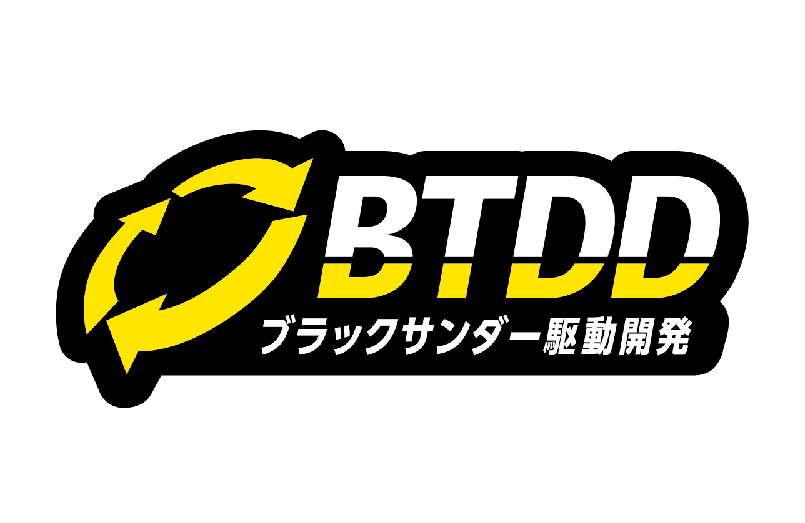
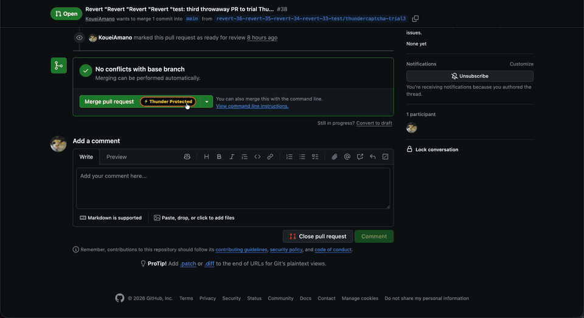
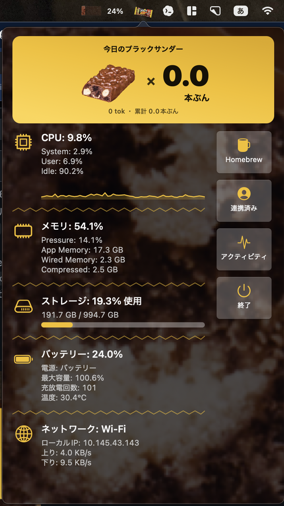
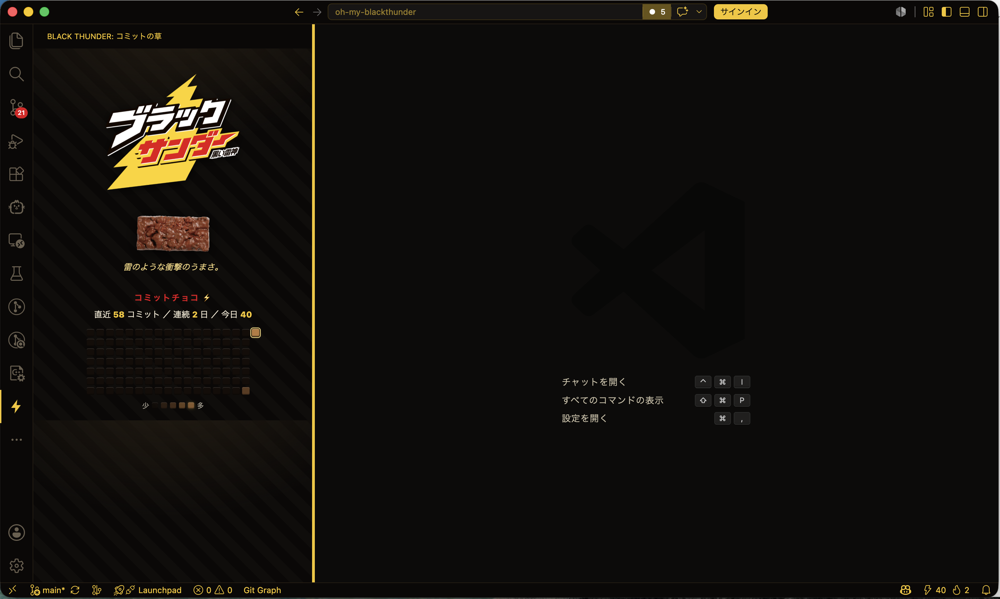
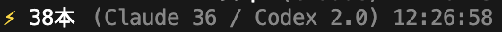

# Oh My Blackthunder ⚡🍫

**開発のおともに、ブラックサンダーを。**

マージする前に「食べました」と認証する。AI の使用量をチョコの本数で眺める。
コミットの草を板チョコにする。そんな遊びを、いつもの開発環境に持ち込むツール集です。

<p>
  
</p>

[有楽製菓株式会社](https://www.yurakuseika.co.jp)のチョコバー「ブラックサンダー」を題材に、
2026年6月6日・7日に秋葉原で開催された
[ブラッカソン](https://www.yurakuseika.co.jp/blackathon/)のために制作しました。
**イベントは終了していますが、デモとソースコードは引き続き公開しています。**

Web サイトは `black.shion.dev` で公開していましたが、Google Cloud の課金を無効にしたため、
**現在はサイトとリーダーボードを利用できません。** この README の GIF・スクリーンショット・
動画は GitHub 上に保存しており、Web サイトの稼働状況にかかわらずご覧いただけます。

> 非公式のファン作品です。「ブラックサンダー」は有楽製菓株式会社の商品・商標です。

[動きを見る](#デモno-thunder-no-merge) · [画面を見る](#いつもの開発環境がブラックサンダーに) · [試してみる](#まずは試してみる) · [アプリ一覧](#アプリ一覧)

## デモ：No Thunder, No Merge

GitHub の Pull Request でマージボタンを押すと、Chrome 拡張 **ThunderCaptcha** が登場。
「私はブラックサンダーを食べました」にチェックすると、元のマージ操作へ進み、
画面にブラックサンダーが降ってきます。



**マージボタン →「食べました」にチェック → Thunder Verified → チョコが降る！**

[元の動画を開く（MP4・約10秒）](./github-chrome-extension-demo.mp4) ·
[MP4をダウンロード](./github-chrome-extension-demo.mp4?raw=true) ·
[静止画を見る](./docs/images/github-chrome-extension-demo.jpg)

GIF は元の録画から作成したプレビューです。アプリの起動やリーダーボードへの接続なしで見られます。
CAPTCHA を模した演出で、実際に食べたかを検証するものではありません。
チョコの演出はチェックへの反応であり、GitHub 側のマージ完了を保証するものではありません。

## いつもの開発環境がブラックサンダーに

各アプリの README に掲載されている実画面です。画像をクリックすると大きく表示できます。

<table>
  <tr>
    <th>RunThunder / macOS</th>
    <th>VS Code / ターミナル</th>
  </tr>
  <tr>
    <td valign="top" width="36%">
      <p>メニューバーには走るチョコと、残量に合わせて減る板チョコのバッテリー。クリックすると AI 使用量やシステムの状態を表示します。</p>
      <a href="./docs/images/runthunder-dashboard.png"></a>
    </td>
    <td valign="top">
      <p><strong>VS Code：コミットの草もチョコに。</strong><br />コミット履歴をチョコのマス目で表示し、今日のコミット数と連続日数をステータスバーで確認できます。</p>
      <a href="./docs/images/vscode-commits.png"></a>
      <p><strong>Zsh：AI 使用量を「本」で眺める。</strong><br />Claude / Codex の使用量を、ブラックサンダーの本数に換算してプロンプトに表示します。</p>
      <a href="./docs/images/terminal-ai-usage.png"></a>
      <p>本数は各ツールの換算ルールによる遊びの指標です。実際に食べた本数とは別に扱います。</p>
    </td>
  </tr>
</table>

## まずは試してみる

### Chrome 拡張：ビルド不要でデモを体験

1. このリポジトリをクローンします。

   ```sh
   git clone https://github.com/a-company-jp/oh-my-blackthunder.git
   ```

2. Chrome で `chrome://extensions` を開き、**デベロッパーモード**を ON にします。
3. **「パッケージ化されていない拡張機能を読み込む」** から、クローンした中の `blackthunder-chrome/` を選びます。
4. 自分がマージできる GitHub の Pull Request を開くと、マージボタンに **Thunder Protected** が表示されます。

チェック後は元のマージ操作が再実行されるため、試す場合はマージしてよい PR を使ってください。
詳しくは [Chrome 拡張の README](./blackthunder-chrome/README.md) を参照してください。

### macOS：RunThunder をインストール

```sh
brew install --cask a-company-jp/tap/runthunder
```

[リリースの ZIP から手動インストール](https://github.com/a-company-jp/oh-my-blackthunder/releases/latest)もできます。
動作環境や初回起動の手順は [RunThunder の README](./RunThunder/README.md) を参照してください。

## アプリ一覧

すべてをまとめてインストールする必要はありません。使いたい環境の README から始められます。

| アプリ・使う場所 | できること | セットアップ |
| --- | --- | --- |
| **ThunderCaptcha** / Chrome・GitHub | マージ前の摂取認証と、チョコが降る演出。 | [Chrome 拡張](./blackthunder-chrome/README.md) |
| **RunThunder** / macOS | 走るメニューバーのチョコ、システムダッシュボード、Claude 使用量の本数表示、板チョコのバッテリー。 | [macOS アプリ](./RunThunder/README.md) |
| **Black Thunder** / VS Code | チョコのコミット履歴、コミット時のザクザク音、保存・ビルド・テスト時の進捗演出。 | [VS Code 拡張](./blackthunder-vscode/README.md) |
| **Oh My Blackthunder** / Zsh | テーマ、ミニゲーム、Claude / Codex の使用量を本数で表示するプロンプト。 | [Zsh フレームワーク](./oh-my-blackthunder/README.md) |
| **Oh My Blackthunder for JetBrains** / IntelliJ 系 IDE | ご褒美通知、がんばりカウンター、応援メッセージ、ダークテーマ、保存時のザクザク音。 | [JetBrains プラグイン](./oh-my-blackthunder-jetbrains/README.md) |
| **Black Thunder for Claude Code** / ターミナル | スピナーの文言とステータスラインをブラックサンダー風に。 | [Claude Code テーマ](./blackthunder-claude-code/README.md) |
| **Black Thunder Web** / ブラウザ | プロジェクト紹介、公開リーダーボード、プロフィール、チーム機能。 | [Web アプリ](./web/README.md) |

### リーダーボードとのつながり

`black.shion.dev` のホスト環境は現在停止しているため、公開リーダーボードの閲覧や、
その環境へのアプリ連携は利用できません。

Web アプリでは、**AI 使用量を換算した「AIザクザク度」**と、**「食べた」と宣言した回数**を集計します。
前者は RunThunder、後者は Chrome 拡張と Web の「食べた！」ボタンから記録します。
Web サービスの構築・認証・クライアント連携は [Web の README](./web/README.md) にまとめています。

## 開発・リポジトリ構成

各アプリをトップレベルのディレクトリに配置した monorepo です。
アプリごとの README・開発ガイド・ランタイムを各ディレクトリに、共通の CI やテンプレートをルートに置いています。
開発を始める場合は [コントリビューションガイド](./CONTRIBUTING.md) を参照してください。

新しいアプリを追加する場合は、トップレベルに専用ディレクトリと README を用意し、
生成物の `.gitignore` もそのアプリ内に置いて、単体で利用できる構成にします。

### 画像・デモ素材

- [`assets-official/`](./assets-official/)：イベント向けのロゴ・ステッカー・商品画像。
- [`web/public/assets/`](./web/public/assets/)：Web で使用しているロゴ・ステッカー・商品画像など。冒頭の BTDD 画像もここから参照しています。
- [`RunThunder/Resources/Frames/`](./RunThunder/Resources/Frames/)：メニューバーで使うアニメーションの連番画像。
- [`docs/images/`](./docs/images/README.md)：README 用のデモ GIF と実画面。出典・変換手順もこちらに記載しています。

共通カラーは **Thunder Yellow `#FFD300` / Thunder Red `#E60012` / White `#FFFFFF`** です。

## ライセンス

[LICENSE.txt](./LICENSE.txt) を参照してください。
