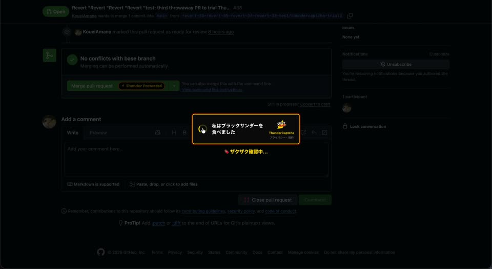

# Black Thunder Monorepo ⚡🍫

**ブラックサンダースタイル**でまとめた、アプリ・ツールのコレクションです。
[有楽製菓株式会社（ユーラク）](https://www.yurakuseika.co.jp) の人気チョコバー
「ブラックサンダー」にインスパイアされています。
ターミナル・エディタ・ブラウザ・macOS のメニューバーに、おやつのご褒美や演出、
AI 使用量をチョコの本数で表すカウンターを取り入れ、日々の開発を楽しくします。

2026年6月6日・7日に秋葉原で開催された
[ブラッカソン](https://www.yurakuseika.co.jp/blackathon/) のために制作しました。
イベントは終了していますが、ソースコードと
[Chrome 拡張のデモ動画](./github-chrome-extension-demo.mp4) は引き続きご覧いただけます。

> ※ 非公式のファン作品です。「ブラックサンダー」は有楽製菓株式会社の商品・商標です。

## デモ動画：No Thunder, No Merge

GitHub の Pull Request をマージする前に「私はブラックサンダーを食べました」と
チェックを入れる Chrome 拡張 **ThunderCaptcha** のデモです。
チェックすると元のマージ操作へ進み、画面にブラックサンダーが降ってきます。
CAPTCHA を模した遊び心のある演出で、実際に食べたかを検証するものではありません。

**[▶ デモ動画を見る（MP4）](./github-chrome-extension-demo.mp4)** ·
[動画をダウンロード](./github-chrome-extension-demo.mp4?raw=true) ·
[Chrome 拡張のインストール方法](./blackthunder-chrome/README.md#インストール方法)

動画はリポジトリ内に保存しているため、アプリの起動やリーダーボードへの接続なしで
ご覧いただけます。動画が再生されない場合は、ダウンロードしてご覧ください。

## アプリ一覧

各アプリは個別に試せます。セットアップ方法は、それぞれの README を参照してください。
Chrome 拡張はビルド不要で、Chrome のデベロッパーモードから `blackthunder-chrome/` を
「パッケージ化されていない拡張機能」として読み込むと利用できます。

| アプリ | 概要 |
|---|---|
| [`oh-my-blackthunder/`](./oh-my-blackthunder/) | Oh My Zsh ライクな小さな **zsh フレームワーク**。テーマ・ミニゲームに加え、**Claude / Codex** の使用量をブラックサンダーの本数で計測します。→ [README](./oh-my-blackthunder/README.md) |
| [`oh-my-blackthunder-jetbrains/`](./oh-my-blackthunder-jetbrains/) | **JetBrains / IntelliJ Platform プラグイン**（Kotlin）。ご褒美通知・がんばりカウンター・ランダム応援・黒×黄×赤のダーク UI テーマ・保存時のザクザク音。→ [README](./oh-my-blackthunder-jetbrains/README.md) |
| [`blackthunder-chrome/`](./blackthunder-chrome/) | **ThunderCaptcha** — GitHub PR の Merge をブラックサンダー摂取認証で挟む **Chrome 拡張**（MV3）。認証するとブラックサンダーが降ります。→ [README](./blackthunder-chrome/README.md) |
| [`blackthunder-vscode/`](./blackthunder-vscode/) | 保存・テスト成功でご褒美をくれる **VS Code 拡張**。ガチャ・ステータスバーのカウント・週間グラフ付き。→ [README](./blackthunder-vscode/README.md) |
| [`RunThunder/`](./RunThunder/) | 走るブラックサンダーがメニューバーで動く **macOS メニューバーアプリ**（RunCat 風）。システムダッシュボード・Claude 使用量の本数表示に加え、**板チョコでバッテリー残量を表示**（旧 blackthunder-battery を統合）。→ [README](./RunThunder/README.md) |
| [`web/`](./web/) | ランディング + リーダーボードの **Web アプリ**（Next.js）。AIザクザク度 / ブラックサンダーカウントのランキングとチーム機能。→ [README](./web/README.md) |
| [`blackthunder-claude-code/`](./blackthunder-claude-code/) | **Claude Code** をブラックサンダー風に。入力欄の上のスピナー動詞を「準チョコ精製中…」等の日本語ネタに置換し、ステータスラインも ⚡ザクザク表示に。クローンして中で `claude` を開くだけ。→ [README](./blackthunder-claude-code/README.md) |

## リポジトリ構成

このリポジトリは monorepo です。各アプリはトップレベルのディレクトリに、それぞれの
README・ランタイム・`.gitignore` を持って配置されています。CI / Issue・PR テンプレート /
dev container / エディタ設定など、リポジトリ全体に関わる設定はルートに置いています。

## 新しいアプリを追加するには

1. トップレベルに新しいディレクトリ（例: `my-app/`）を作成します。
2. 専用の `README.md` を用意し、ローカル実行で生成物が出る場合は専用の `.gitignore`
   も置きます（パターンはそのフォルダに限定。例: `/cache/*`）。
3. クローン / 単体利用ができるよう、アプリは自己完結させます。

## スタイル

- Thunder Yellow: RGB(255,211,0)
- Thunder Red: RGB(230,0,18)
- Normal White: #FFFFFF

## ライセンス

[LICENSE.txt](./LICENSE.txt) を参照してください。
